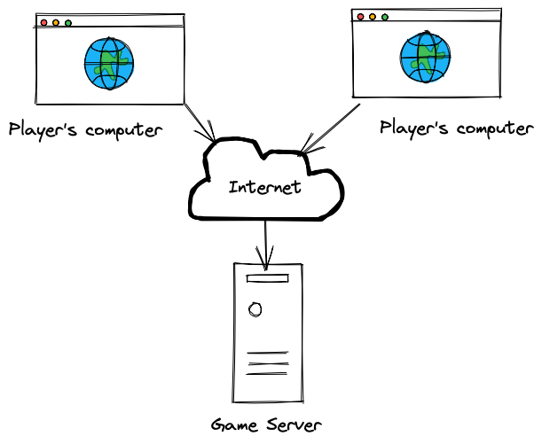
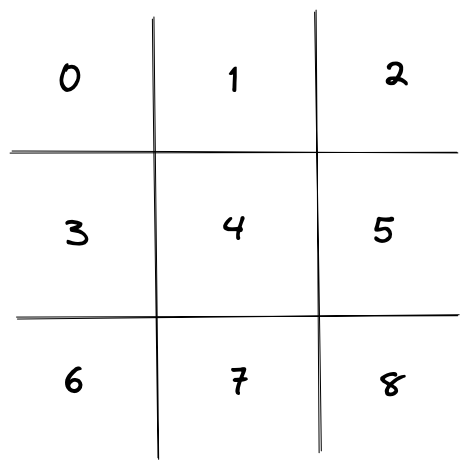
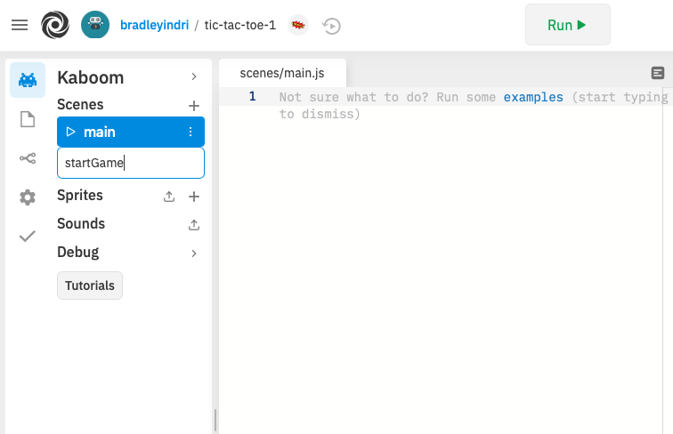
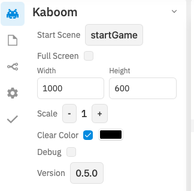
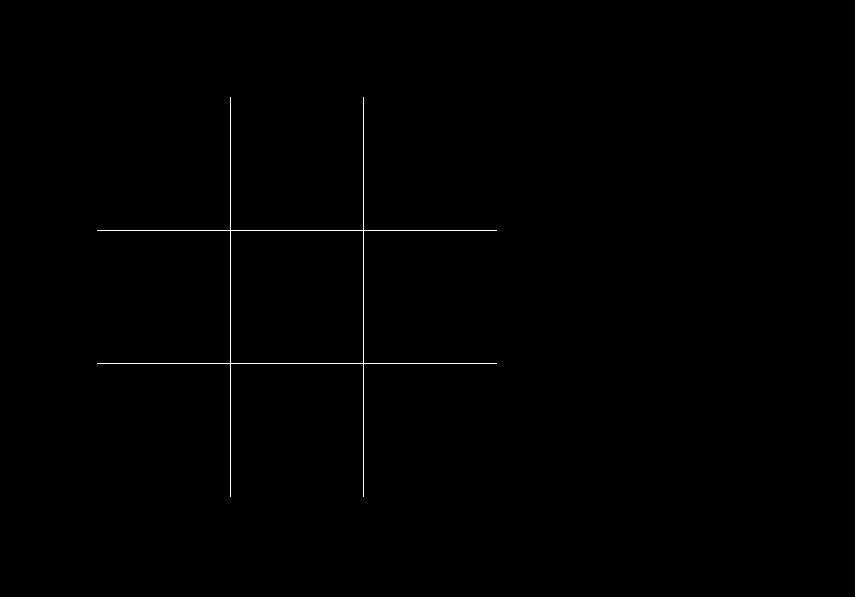
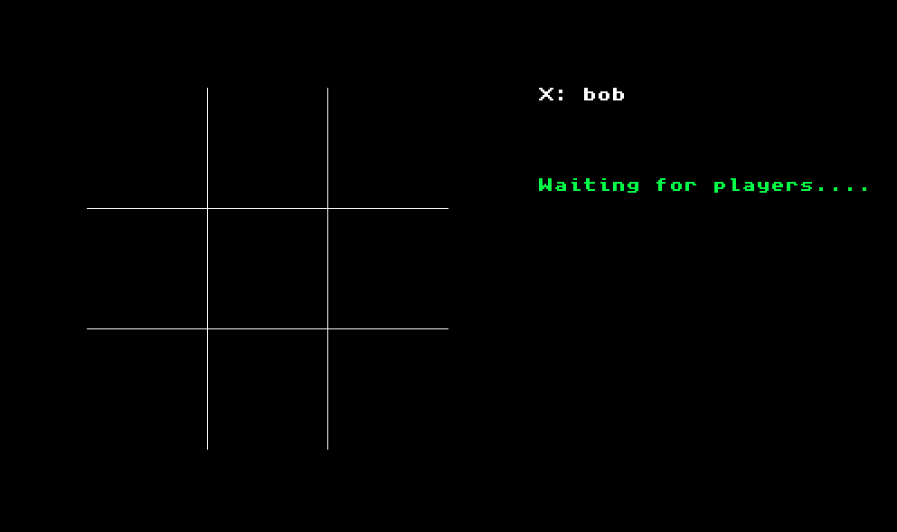
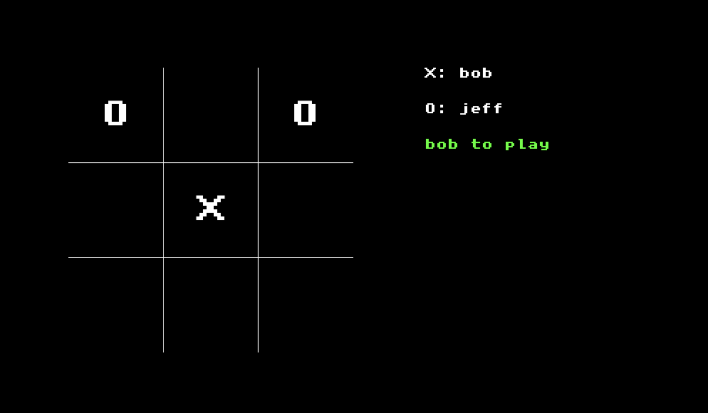

# Building Tic Tac Toe with WebSockets and Kaboom.js

Tic-tac-toe, or Noughts and Crosses, or Xs and Os, is a classic simple game for two players. It's usually played with paper and pen, but it also makes a good first game to write for network multiplayer. 

In this tutorial, we will create an online tic-tac-toe 2 player game, using a [Node.js](https://nodejs.org/en/) server and [socket.io](https://socket.io) to enable real time game play across the internet. We'll also use Kaboom.js to create the game interface. 

## How do multiplayer games work?

Multiplayer games have an architecture that typically looks something like this:



Players (clients) connect to a _game server_ over the internet. The game server is really where the game is running - all the game rules and score etc are calculated on the game server. The player's computers render the graphics for the game, and send player commands (from keyboard, mouse, gamepad, etc) back to the game server. The game server can check if these commands are valid, and then update the _game state_. The game state is a representation of all the variables, players, data and information about the game. This game state is then transmitted back to all the players, so they can all update the graphics. 

From this, we can see that there is quite a lot of communication that needs to happen between the player's computers and the game server. With the [HTTP](https://en.wikipedia.org/wiki/Hypertext_Transfer_Protocol) protocol that web sites usually use, a browser opens a connection to a server, then makes a request to the server, and the server sends back data, and closes the connection. There is no way for the server to initiate sending data to the browser. It also has a lot of overhead to open and close a connection each time data is requested and sent. 

Games generally need a two way, or _bidirectional_ link, so that the game server can send and notify the players of updates to the game state. Games also need a quick link, so a more permanent connection is better. [WebSockets](https://en.wikipedia.org/wiki/WebSocket) are an advanced internet protocol that allows us to create a two-way, persistent connection between a browser and a server. We'll use the [socket.io](https://socket.io) package to help us manage WebSocket connections in this project. 


## Creating a new project

For this project, we'll need to create 2 repls - one for the game server, and one for the players. The game server will use Node.js, and the player project will use Kaboom. Head over to Replit and create a two new repls: 

- To create the player project, choose "Kaboom" as your project type. Give this repl a name, like "tic-tac-toe".
- To create the server project, choose "Node.js" as your project type. Give this repl a name, like "tic-tac-toe-server".

We'll code in the server repl to start, and then switch between repls as we build the game. 

## Setting up socket.io on the server

In the server project, you should have a file called `index.js`. To import and setup [socket.io](https://socket.io), add the following code: 

```js
const http = require('http');
const sockets = require('socket.io')

const server = http.createServer();
const io = sockets(server,  {
  cors: {
    origin: "https://tic-tac-toe.<your-user-name>.repl.co",
    methods: ["GET", "POST"]
  }
});

server.listen(3000, function() {
  console.log('listening on 3000');
});

```

In the first 2 lines, we import the built-in node [`http`](https://nodejs.org/api/http.html) package and the [`socket.io`](https://socket.io) package. The `http` package enables us to run a simple HTTP server. The `socket.io` package extends that server to add [WebSocket](https://developer.mozilla.org/en-US/docs/Web/API/WebSockets_API) functionality. 

To create the HTTP server, we use the `http.createServer();` method. Then we setup the socket.io part, by creating a new `io` object. To do this, we pass in the HTTP server object along with some configuration for [CORS](https://developer.mozilla.org/en-US/docs/Glossary/CORS). CORS stands for "Cross Origin Resource Sharing" - which tells the server which other sites are allowed to connect to it and access it. We set the `origin` to allow our Player repl to connect. Replace the `origin` value with the URL of the player project repl you set up earlier. 

Lastly, we start the server up by calling its `listen` method, along with a port to listen on. We use 3000 as this is a standard for Node. If it starts succesfully, we write a message to the console to let us know.

We'll add the rest of the server code above the `server.listen` line, as we only want to start the server up after all the other code is ready. 

## Tracking the game state

Now that we we have a server, lets think a bit about how we will represent, or model, the game. Our tic-tac-toe game will have a few different properties to track: 

- The status of the game: What is currently happening? Are we are waiting for players to join, are the players playing, or is the game over?
- The current positions on the tic-tac-toe board. Is there a player in a grid block, or is it empty?
- All the players. What are their names, and which symbol are they using, `X`, or `O`?
- The current player - Whose turn is it to go?
- If the game ends in a win, who won it?

For the status of the game, we'll add a [enumeration](https://masteringjs.io/tutorials/fundamentals/enum) of the possible states we can expect. This makes it easier to track and use them as we go through different phases of the game. 

```js
const Statuses = {
  WAITING: 'waiting', 
  PLAYING: 'playing', 
  DRAW: 'draw', 
  WIN: 'win'
}
```

- WAITING: We are waiting for all the players to join the game. 
- PLAYING: The players can make moves on the board.
- DRAW: The game has ended in a draw.
- WIN: A player has won the game.

Now lets add a Game State object to track everything:

```js
let gameState = {
  board: new Array(9).fill(null), 
  currentPlayer: null,
  players : [], 
  result : {
    status : Statuses.WAITING
  }
}
```

First, we have a representation of the tic-tac-toe board as an array, with 9 elements. This is how the array elements are mapped to the board:




The numbers in each of the blocks represent the index the board position is represented in the array. Initially, we fill all the elements of the array with `null` to indicate that the space is open. When players make a move to occupy a open space, we'll add a reference to the player instead. That way we can keep track of which blocks are empty, and which are occupied by which player. 

Next, we have `currentPlayer`, which we will alternately set to each player, when it is their turn to move. 

Then there is an array called `players`, which will hold references to both of the players playing the game. This will allow us to show the names of the players on screen, as well as generally keep track of the players. 

Then we have the `result` field, which is updated after every move. This field will contain the status of the game (as we defined above). As it is represented as an object, it will also be able to hold extra fiields. We'll use that functionality to add a reference to the winner of the game, if the game ends in a win. 

## Accepting connections

When a player connects via WebSockets, Sockets.io will fire a [`connection`](https://socket.io/docs/v4/server-instance/#connection) event. We can listen for this event, and handle tracking the connection, as well as creating listeners for other custom events. There are a few [custom events](https://socket.io/docs/v4/emitting-events/) we can define here, that we will enable our player's to emit: 

- `addPlayer`. We'll use this event for a player to request joining the game. 
- `action`. This is used when a player wants to make a move. 
- `rematch`. Used when a game is over, but the players want to play again. 

We can also listen for the built-in [`disconnect`](https://socket.io/docs/v4/server-socket-instance/#disconnect) events as well, which will alert us if a player leaves the game (eg. closes the browser window or loses internet connection etc). 

Let's add the code that will hook up our listeners to the events:

```js
io.on('connection', function (connection) {
  connection.on('addPlayer', addPlayer(connection.id)); 
  connection.on('action', action(connection.id)); 
  connection.on('rematch', rematch(connection.id));
  connection.on('disconnect', disconnect(connection.id)); 
}); 
```

Looks neat. Now let's implement each of these listener functions, starting with `addPlayer`. 

**Side Note:** Normally, in examples for the custom listeners you'll see the handler code added immediately with an anonymous function, like this:

```js
io.on('connection', function (connection) {
  connection.on('addPlayer', (data)=> {
  	// some code here
  }); 

   connection.on('action', (data)=> {
  	// some code here
  }); 

  // etc ...
});
```

This is convenient, especially when there are couple handlers, with only a small amount of code each. It's also handy, because in each of the handler functions, you still have access to the `connection` object, which is not passed on each event. However, it can get a little messy and unwieldy if there are many event handlers, with more complex logic in each. We do it differently, so that we can separate out the handlers into functions elsewhere in the code base. We do have one problem to solve though - if they are separate functions, how will they access the `connection` paramater, so that we can tell which player send the command? With the concept of [_closures_](https://developer.mozilla.org/en-US/docs/Web/JavaScript/Closures) which are well supported in Javascript, we can make functions that return another function. Using this method, we can pass in the `connection.id` parameter to the first wrapping function, and it can return another function that takes the data arguments from the socket.io event caller. Because the second function is within the _closure_ of the first, it will have access to the `connection.id` parameter. The pattern looks like this: 

```js
io.on('connection', function (connection) {
  connection.on('addPlayer', addPlayer(connection.id)); 
  connection.on('action', action(connection.id)) ; 
  // etc ...
});


function addPlayer(socketId){
	return (data)=>{
		// code here
	}
}

function action(socketId){
	return (data)=>{
		// code here
	}
}
```


## Handling new players

Add the following function to handle adding players: 

```js
function addPlayer(socketId){
  return (data)=>{
    const numberOfPlayers = gameState.players.length; 
    if (numberOfPlayers >= 2){
      return; 
    } 
      
    let nextSymbol = 'X'; 
    if (numberOfPlayers === 1){
      if (gameState.players[0].symbol === 'X'){
        nextSymbol = 'O'; 
      }
    }

    const newPlayer = {
      playerName: data.playerName, 
      id: socketId, 
      symbol: nextSymbol
    }; 

    gameState.players.push(newPlayer); 
    if (gameState.players.length === 2){
      gameState.result.status = Statuses.PLAYING;
      gameState.currentPlayer = newPlayer; 
    }
    io.emit('gameState', gameState); 
    
  }
}
```
This function does quite a bit. Let's go through the main features. 

- It checks to see how many players are already in the game. If there are already two, it returns early, without changing anything. If this check passes, then it goes on to add the new player. Note that even tho there is no space in the game for the new player, we don't disconnect them - they will still get updates and will be able to watch the match, like a spectator. 
- The function figures out which symbol, _X_ or _O_, the new player should be. It will assign _X_ to the first player. If there is already a player, and the existing player's symbol is _X_, then it will assign _O_ to the new player. Note that there is a possible case where there is only one player, and their symbol is _O_. This case occurs if there are 2 players, and the player with the _X_ symbol disconnects from the game, leaving only the player with the _O_ symbol. This is why we always check what symbol the existing player in the game has. 
- Then the function constructs a new player object, with some identifying information, including the name that the player sends through, the socketID they connected on, and their symbol. When a new player requests to join, we expect them to send an object with a field `playerName` to tell us their handle. 
- Now we add the new player to the player array in our `gameState` object, so that they are now part of the game. 
- We check if we now have 2 players. If we do, we can start playing! To start, we update the Status of the game to `PLAYING`, and set the `currentPlayer`, i.e, the player who is first to go, as the latest player to have joined. 
- Finally, we use the socket.io [`emit`](https://socket.io/docs/v4/emitting-events/) function to send the updated `gameState` to all connections. This will allow them to update the player's display.

## Handling player actions

The next handler takes care of moves that player's want to make. We expect that the the incoming data from the player will have a property called `gridIndex` to indicate which block on the board the player wants to mark. This should be a number that maps to the numbers for each block in the board, as in the picture earlier on. 

```js
function action(socketId){
  return (data)=> {
    if (gameState.result.status === Statuses.PLAYING && gameState.currentPlayer.id === socketId){
      const player = gameState.players.find(p => p.id === socketId); 
      if (gameState.board[data.gridIndex] == null){
        gameState.board[data.gridIndex] = player; 
        gameState.currentPlayer = gameState.players.find(p => p !== player);  
        checkForEndOfGame();
      }
    }
    io.emit('gameState', gameState); 
  }
}
```

In this function we check a couple things first: 
- The game status must be `PLAYING` - players can't make moves if the game is in any other stage. 
- We check that the player attempting to make the move is the `currentPlayer`, i.e. the player who's turn it is to go. 

If these conditions are met, then we find the player in the `gameState.players` array, using the built in [`find`](https://developer.mozilla.org/en-US/docs/Web/JavaScript/Reference/Global_Objects/Array/find) method on arrays, by looking for the player by their `socketId`. 

Now we can check if the board position (`gridIndex`) requested by the player is available, by checking that the value for that position in the `gameState.board` array is `null`. If it is available, we assign the player to that board position. Since the player has made a successful move, we need to give the other player a turn. We switch the `gameState.currentPlayer` to the other player, by using the array [`find`](https://developer.mozilla.org/en-US/docs/Web/JavaScript/Reference/Global_Objects/Array/find) method again to get the player who _does not_ match the current player. 

We also need to check if the move the player made changed the status of the game. Did that move win them the game, or is it a draw, or is the game still in play? We call out to a function `checkForEndOfGame` to check for this. We'll implement this function a little later, after we've done with all the handlers. 

Finally, we send out the latest `gameState` to all the players (and spectators) again, so they can update the game UI. 

## Handling a rematch request

When the game has ended, it's likely that the player's would want to play again. Perhaps they want to play for best of 5. 

```js
function rematch(socketId){
  return (data) => {
    if (gameState.players.findIndex(p=> p.id === socketId) < 0) return; // Don't let spectators rematch
    if (gameState.result.status === Statuses.WIN || gameState.result.status === Statuses.DRAW){
      resetGame(); 
      io.emit('gameState', gameState); 
    }
  }
}
```

This function first checks if the connection sending the rematch request is actually one of the players, and not just a spectator. If we can't find a match for a player, we return immediately, making no changes. 

Then we check if the game is in one of the final states, either `WIN` or `DRAW`. If it is, we call out to a function `resetGame` to setup the game again. Finally, we send out the latest `gameState` to all the players again. 

Let's implement the `resetGame` function.

```js
function resetGame(){
  gameState.board = new Array(9).fill(null); 

  if (gameState.players.length === 2){
    gameState.result.status = Statuses.PLAYING; 
    const randPlayer = Math.floor(Math.random() * gameState.players.length); 
    gameState.currentPlayer = gameState.players[randPlayer]; 
  } else {
    gameState.result.status = Statuses.WAITING;
    gameState.currentPlayer = null;  
  }
}
```
This function does a few things: 

- It creates a new array for the `gamestate` board. This effectively clears the board, setting all the positions back to `null`, or empty. 
- Then it checks that there are still 2 players connected. If there are, it can immediately set the game status back to `PLAYING`. It then also chooses at random which player's turn it is to go. We do this randomly, so that there isn't one player getting an advantage or disadvatage by going first every time. 

If there is only one player remaining, we set the game status to `WAITING` instead, so that we listen for any new players who want to join. We also set the `currentPlayer` to null, as we will choose which player should go once the new player has joined. 

## Handling disconnects

The last handler we need to implement is if a connection to a player is lost. This could be because the player has exited the game (by closing the browser tab), or has other internet issues. 

```js
function disconnect(socketId){
  return (reason) => {
    gameState.players = gameState.players.filter(p => p.id != socketId);
    if (gameState.players !== 2){
      resetGame(); 
      io.emit('gameState', gameState); 
    }
  }
}
```
This function uses the built in array [`filter`](https://developer.mozilla.org/en-US/docs/Web/JavaScript/Reference/Global_Objects/Array/filter) function to remove the player that disconnected from the server. It could be possible that the disconnect event isn't from a player, but from a spectator. We account for this possibility by checking the number of players left after filtering the disconnecting socket from the player list. Only if there is not 2 players remaining after filtering do we then reset the game, and send out the updated gamestate. 

## Checking for the end of the game

Now we can get back to implementing the `checkForEndOfGame` function we referenced in the `action` handler. 

There are 2 cases we are interested in detecting: A win, or a draw. 

There are a few patterns that determine if a player has won at tic tac toe. Let's map them to our board with its indexed blocks: 

 

We can encode each of these winning patterns into an array of 3 numbers each. Then we can add each of those patterns to a larger array, like this:

```js
const winPatterns = [
  [0, 1, 2],
  [3, 4, 5], 
  [6, 7, 8], 
  [0, 3, 6], 
  [1, 4, 7], 
  [2, 5, 8],
  [0, 4, 8], 
  [2, 4, 6] 
]
```

Now that we have each winning pattern in an array, we can loop through each of them to see if there is a player that has positions that match any of the patterns. 

Since the players are also in an array in `gameState.players`, we can loop through that array, and then check each player against the winning pattern array. If a player matches any of those patterns, we can change the game status to `WIN` and set that player as the winner in the results.

Here is the code to do that:

```js
function checkForEndOfGame(){

  // Check for a win
  gameState.players.forEach(player => {
    winPatterns.forEach(seq => {
      if (gameState.board[seq[0]] == player
          && gameState.board[seq[1]] == player
          && gameState.board[seq[2]] == player){
        gameState.result.status = Statuses.WIN; 
        gameState.result.winner = player;
      }
    });
  });

  // Check for a draw
  if (gameState.result.status != Statuses.WIN){
    const emptyBlock = gameState.board.indexOf(null); 
    if (emptyBlock == -1){
      gameState.result.status = Statuses.DRAW; 
    }
  }
}
```

We also check for a draw in this function. A draw is defined as when all the blocks are occupied (no more moves can be made), but no player has matched one of the win patterns. To check if there are no more empty blocks, we use the array method [`indexOf`](https://developer.mozilla.org/en-US/docs/Web/JavaScript/Reference/Global_Objects/Array/indexOf) to find any `null` values in `gameState.board` array. Remeber that `null` means an empty block here. The `indexOf` method will return `-1` if it can't find any `null` values. In that case, we set the game status to `DRAW`, ending the game. 

We have all the functionality we need now on the server. Let's move on to build the Kaboom website that the players will use to play the game. 

## Setting up Kaboom with socket.io

The first thing we need to do is create an opening scene in Kaboom that will prompt for the player's name, and setup socket.io so we can attempt to connect to the server. Head over to the Kaboom replit we created earlier, and add a new scene called `startGame`: 



Now we can add a reference to socket.io. Normally in a plain HTML project, we could add a [`<script>`](https://www.w3schools.com/tags/tag_script.asp) tag and reference the socket.io [client script, hosted automatically on our game server](https://socket.io/docs/v4/client-installation/#Installation). However, in the Kaboom.js project type on Replit, we don't have direct access to change the underlying HTML files. Therefore, we need to add the script programmatically. We can do it by accessing the [`document`](https://developer.mozilla.org/en-US/docs/Web/API/Document) object available in every browser, and insert a new element with our script. 

```js 
let script = document.createElement("script");  
script.src = 'https://tic-tac-toe-server.<YOUR_USER_NAME>.repl.co' + '/socket.io/socket.io.js'
document.head.appendChild(script);
```
Replace the `<YOUR_USER_NAME>` part of the URL with your Replit username. This code inserts the new `<script>` tag into the [`<head>`](https://www.w3schools.com/tags/tag_head.asp) section of the underlying HTML page that Kaboom runs in. 

Let's move on to the code to prompt the player to enter their name. 

```js
const SCREEN_WIDTH = 1000; 
const SCREEN_HEIGHT = 600;

add([
  text("What's your name? ",20),
  pos(SCREEN_WIDTH / 2, SCREEN_HEIGHT / 3),
  origin("center")
]);

const nameField = add([
  text("",20),
  pos(SCREEN_WIDTH / 2, SCREEN_HEIGHT / 2),
  origin("center")
]);

charInput((ch) => {
    nameField.text += ch;
});

keyRelease("enter", ()=>{
    go("main", {playerName: nameField.text} );
})
```

To keep the calculations for the UI layout simpler, we'll use a fixed size for the screen. That's where the 2 constants for the screen width and height come in. 

Then we use the Kaboom [`add`](function) to display the prompt "What's your name?" on the screen, using the  [`text`](https://kaboomjs.com/#text) component. We choose a position halfway across the screen, `SCREEN_WIDTH / 2`, and about a third of the way down the screen, `SCREE_HEIGHT / 3`. We add the [`origin`](https://kaboomjs.com/#origin) component, set to `center`, to indicate that the positions we set must be in the center of the text field. 

Then we add another object, with an empty `""` text component. This will display the character the player types in. We position exactly halfway down and across the screen. We also hold a reference to the object in the constant `nameField`

To get the user keyboard input, we use the Kaboom function [`charInput`](https://kaboomjs.com/#charInput). This function calls an event handler each type a key on the keyboard is pressed. We take that character and append it to the text in the `nameField` object. Now, when a player presses a key to enter their name, it will show up on the screen. 

Finally, we use the Kaboom function [`keyRelease`](https://kaboomjs.com/#keyRelease) to listen when the player pushed the `enter` key. We'll take that as meaning they have finished entering their name and want to start the game. In the handler, we use the Kaboom [`go`](https://kaboomjs.com/#go) to redirect to the main scene of the game. 

## Setting Kaboom parameters

We've create a new starting scene, and we want to have a fixed size for the game window. We need to update the Kaboom settings so that it reflects those choices. 

To set up the game play environment, click the dropdown next to the Kaboom menu. Set the "Start Scene" to "StartGame". Uncheck "Full Screen", and set the Width to 1000 and Height to 600. Set the scale to "1". Then choose dark blue or black as the "Clear Color". 



## Adding the game board 

Now we can add the UI elements for the game itself. Open the "main" scene in your Kaboom repl, and add the following code to draw the tic-tac-toe board. 

```js
        // Board
        add([
          rect(1,400),
          pos(233,100),
        ]);  

        add([
          rect(1,400),
          pos(366,100),
        ]); 
 
        add([
          rect(400,1),
          pos(100, 233),
        ]); 

        add([
          rect(400,1),
          pos(100, 366),
        ]); 
```

This adds 4 rectangles, of width 1 pixel and length 400 pixels to the screen, which actually makes each rectange more like a line. We use this to draw thin lines to create the classic tic-tac-toe board shape. The first 2 rectangles are the vertical lines, and the second 2 the horizontal lines. We place them closer to the left side of the screen, instead of the center, as we'll have game information on the right hand side of the screen. 

If you run the game, and enter your name, you should see the board layout like this:



We have the outline of the board, but we need to add a way to draw the _X_ and _O_ symbols in each block. To do this, we'll add objects with text components in each block of the board. First, we'll make an array containing the location and size of each block: 

```js
const boardSquares = [
  {index: 0, x: 100, y: 100, width:133, height: 133 }, 
  {index: 1, x: 233, y: 100, width:133, height: 133 }, 
  {index: 2, x: 366, y: 100, width:133, height: 133 }, 
  {index: 3, x: 100, y: 233, width:133, height: 133 }, 
  {index: 4, x: 233, y: 233, width:133, height: 133 }, 
  {index: 5, x: 366, y: 233, width:133, height: 133 }, 
  {index: 6, x: 100, y: 366, width:133, height: 133 }, 
  {index: 7, x: 233, y: 366, width:133, height: 133 }, 
  {index: 8, x: 366, y: 366, width:133, height: 133 }
];
```

Then we can run through this array, and create a text object that we can write to when we want to update the symbols on the board. Let's create a function to do that. 

```js
function createTextBoxesForGrid(){
  boardSquares.forEach((square)=>{
    let x = square.x + square.width*0.5; 
    let y = square.y + square.height*0.5; 
    square.textBox = add([
      text('', 40), 
      pos(x, y), 
      origin('center')
    ]);
  })
}

createTextBoxesForGrid();     
```
This function uses the array [`forEach`](https://developer.mozilla.org/en-US/docs/Web/JavaScript/Reference/Global_Objects/Array/forEach) method to loop through each "square" definition in the b`boardSquares` array. We then find the center `x` and `y` of the square, and [`add`](https://kaboomjs.com/#add) a new text object to screen, and also add it to the square definition on the field `textBox` so we can access it later to update it. We use the `origin` component to ensure the text is centered in the square. 

Finally, we call the function to create the text boxes. 

## Adding player names and game status

Now let's add some areas for the player's names and for the current status of the game (eg, who's turn it is, if someone has won, or if it's a draw etc). 

```js
// Players and game status elements
const playerOneLabel = add([
  text('', 16),
  pos(600, 100),
]);

const playerTwoLabel = add([
  text('', 16),
  pos(600, 150),
]);

const statusLabel = add([
  text('', 16),
  pos(600, 200),
  color(0,1,0)
]); 
```
Here we add 3 objects with [`text`](https://kaboomjs.com/#text) components. The first 2 are placeholders for the player's names and symbols. The third one is for the game status. They are positioned to the right of the screen, and contain empty text to start. We'll change the contents as we receive new game states from the server. The last object has a `color` component to set the color of the text to green. This is to make the status message stand out from the rest of the text.  


## Connecting to the server

To connect to the game server, we need to initialize the socket.io library we dynamically added earlier. We need to provide the URL to the server repl, so copy that and add this code along with the server URL: 

```js
var socket = io('https://tic-tac-toe-server.<YOUR_USER_NAME>.repl.co'); 

socket.on('connect', function(){
  socket.emit("addPlayer", {
    playerName: args.playerName
  });
}); 
```
In the first line, we initialize the [socket.io client library](https://socket.io/docs/v4/client-initialization/) to connect to the server. Then we add a listener to the [`connect`](https://socket.io/docs/v4/client-socket-instance/#Socket-connected) event. This lets us know when we have established a connection to the server. 

If we have a connection, we then [`emit`](https://socket.io/docs/v4/emitting-events/) an event to the server, with our custom event type `addPlayer`. We also add in the the player name, which we passed to this scene from the `startGame` scene. Any arguments passed between scenes are accessible through the `args` parameter within the scene. Emmitting the `addPlayer` event to the server will cause the `addPlayer` event handler to fire on the server side, adding the player to the game, and emitting back the game state. 

## Handling updated game state

Recall that our server emits a `gameState` event whenever something changes in the game. We'll listen for that event, and update all the UI elements in a event handler. 

First, we need to add the definitions of each status as we have done on the server side, so that we can easily reference them in the code: 

```js
const Statuses = {
	WAITING: 'waiting', 
	PLAYING: 'playing', 
	DRAW: 'draw', 
	WIN: 'win'
}
```

Now we can add a listener and event handler: 

```js
socket.on('gameState', function(state){
  for (let index = 0; index < state.board.length; index++) {
    const player = state.board[index];
    if (player != null){
      boardSquares[index].textBox.text = player.symbol; 
    } else
    {
      boardSquares[index].textBox.text = ''; 
    }
  }

  statusLabel.text = ''; 
  switch (state.result.status) {
    case Statuses.WAITING:
      statusLabel.text = 'Waiting for players....'; 
      break;
    case Statuses.PLAYING:
      statusLabel.text = state.currentPlayer.playerName + ' to play'; 
    break;
    case Statuses.DRAW:
      statusLabel.text = 'Draw!'; 
    break;
    case Statuses.WIN:
      statusLabel.text = state.result.winner.playerName + ' Wins! \nPress R for rematch'; 
    break;          
    default:
      break;
  }
  
  playerOneLabel.text = ''; 
  playerTwoLabel.text = ''; 
  if (state.players.length > 0){
    playerOneLabel.text = state.players[0].symbol + ': ' + state.players[0].playerName; 
  }

  if (state.players.length > 1){
    playerTwoLabel.text = state.players[1].symbol + ': ' + state.players[1].playerName; 
  }

});
```

This function looks quite large, but it is mainly just updating the text boxes we added. 
First, we loop through the board positions array that is passed from the server on the `state` payload. We check if there is a player in each block position. If there is a player, we write that player's symbol to the corresponding text box, found in the `boardSquares` array we created above. If there is no player in the block, i.e it's a `null` value, we write an empty string to the text block.

Then we update the `statusLabel`, to show what is currently happening in the game. We use a [`switch`](https://developer.mozilla.org/en-US/docs/Web/JavaScript/Reference/Statements/switch) statement to create logic for each of the possibilities. We write a different message, drawing from different data in the gameState object to the `statusLabel` text box depending on the status. 

Then we update the player's name text boxes. First we reset them, in any of the players has dropped out etc. Then we update the text boxes with the player's symbol and name. Note that we first check if there are the corresponding players in the array. 

Now we are done with updating from the game state. If you run the game again and enter your name (make sure the server is also running), you should see something like this:



You can connect to your game in another browser tab, and enter another name. Then you should see both names come up, and the status message change to allow a player to make a move. Of course, we haven't yet implement the code to enable making a move from the UI, so let's do that now. 

## Handling player moves

We want a player to be be able to click on a block to place their move. Kaboom has a function [`mouseRelease`](https://kaboomjs.com/#mouseRelease) which we can use to handle mouse click events. All we'll need then is the position the mouse cursor is at, and map that to one of the board positions, using our `boardSquares` array to do the lookup. We can use the Kaboom function [`mousePos`](https://kaboomjs.com/#mousePos) to get the coordinates of the mouse. Let's implement that now: 

```js
mouseRelease(() => {
  const mpos = mousePos();
  // find the square we clicked on 
  for (let index = 0; index < boardSquares.length; index++) {
    const square = boardSquares[index];
    if (mpos.x > square.x 
        && mpos.x < square.x + square.width 
        && mpos.y > square.y 
        && mpos.y < square.y + square.height){
          socket.emit("action", {
            gridIndex: square.index
          }); 
          break; 
        } 
  }
});
```
If we find a 'hit' on one of the board squares, we emit our `action` event, and pass as the payload data the index of the square that was clicked on. The server listens for this event, and runs the logic we added for the `action` event on the server side. If the action changes the game state, the server will send back the new game state, which we can update. 

The only other input we need to implement is to check if the player wants a rematch. To do that, we'll assign the `r` key as the rematch command. We can use the Kaboom function [`charInput`](https://kaboomjs.com/#charInput) to listen for key press events. We'll check if the key is `r`, or `R`, then emit the `rematch` event. We don't have any data to pass with that, so we'll just pass `null`. 

```js
charInput((ch) => {
  if (ch === 'r' || ch === 'R'){
    socket.emit("rematch", null)
  }
});
```

Now if you run the game (and the server), and open the game in another tab, you should be able to play tic-tac-to against yourself! You can send a link to the game to a friend, and see if they can join and play against you. 

 

## Next Steps

Congratulations, you've completed making a multi-player game! Now that you know the basics of creating an internet game, maybe you can try different games, like checker or chess or go. 

Happy coding!


